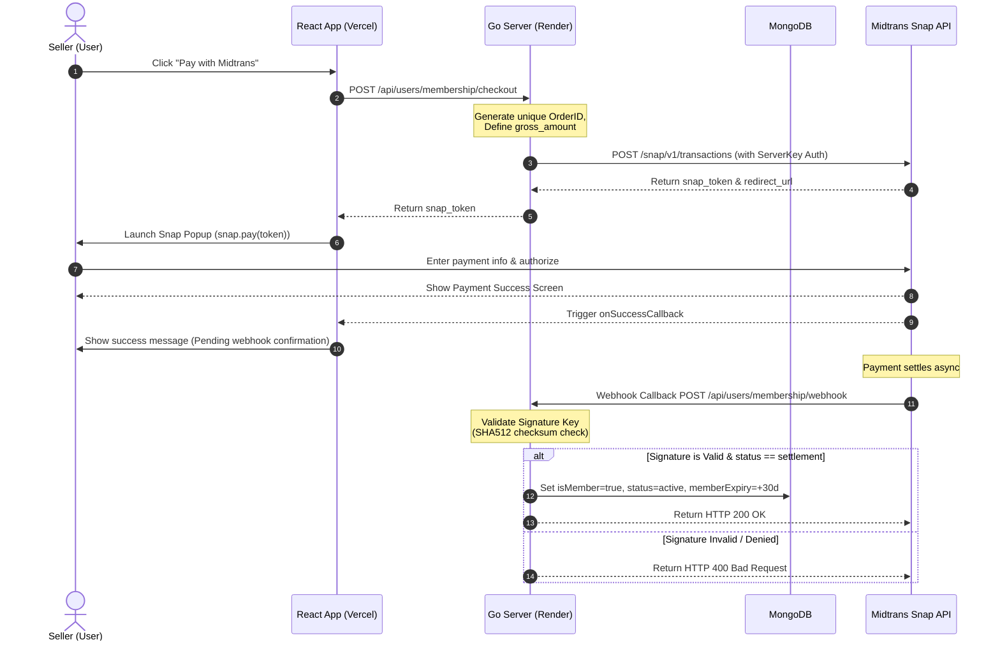

# Midtrans Payment Gateway Integration Specification

This document details the architecture, configurations, and implementation roadmap required to transition the Dagangly membership payment flow from the simulated mock checkout to a real, secure **Midtrans Snap API** integration.

---

## 1. Overview & Architecture

The integration leverages Midtrans Snap for secure client-side payment popups, backed by Go server-side token generation and secure webhook notification handlers.



---

## 2. Configuration & Environment Variables

Add these environment variables to your respective hosting configurations (e.g. Render dashboard environment variables for the backend, and Vercel dashboard environment variables for the frontend):

### Go Backend Env (`backend/.env`)
```ini
MIDTRANS_MERCHANT_ID=YOUR_MIDTRANS_MERCHANT_ID
MIDTRANS_CLIENT_KEY=YOUR_MIDTRANS_CLIENT_KEY
MIDTRANS_SERVER_KEY=YOUR_MIDTRANS_SERVER_KEY
MIDTRANS_IS_PRODUCTION=false
```

### React Frontend Env (`frontend/.env`)
```ini
VITE_MIDTRANS_CLIENT_KEY=YOUR_MIDTRANS_CLIENT_KEY
```

---

## 3. Midtrans Dashboard URL Configurations

Log in to the [Midtrans Dashboard](https://dashboard.midtrans.com) and navigate to **Settings > Configuration** to set the following endpoints:

### A. Notification URLs (Points to Go Backend on Render)
* **Payment Notification URL**: 
  `https://dagangly-api.onrender.com/api/users/membership/webhook`
* **Recurring Notification URL**: 
  `https://dagangly-api.onrender.com/api/users/membership/webhook`
* **Pay Account Notification URL**: 
  `https://dagangly-api.onrender.com/api/users/membership/webhook`

### B. Redirect URLs (Points to React Frontend on Vercel)
* **Finish Redirect URL** (Success): 
  `https://dagangly.vercel.app/seller/dashboard?payment=success`
* **Unfinish Redirect URL** (Pending/Cancelled): 
  `https://dagangly.vercel.app/seller/dashboard?payment=pending`
* **Error Redirect URL**: 
  `https://dagangly.vercel.app/seller/dashboard?payment=error`

---

## 4. Implementation Details

### Go Backend (Render)

#### Step A: Install SDK
Install the official Midtrans Go library:
```bash
go get github.com/midtrans/midtrans-go
```

#### Step B: Token Generation Handler (`backend/internal/handlers/users.go`)
Create a handler to requests a Snap payment token from Midtrans:
```go
import (
    "github.com/midtrans/midtrans-go"
    "github.com/midtrans/midtrans-go/snap"
)

func (h *UserHandler) CreateMembershipTransaction(c *gin.Context) {
    userID := c.GetString("userID")
    
    // 1. Initialize Midtrans snap client
    var client snap.Client
    client.New(os.Getenv("MIDTRANS_SERVER_KEY"), midtrans.Sandbox) 
    if os.Getenv("MIDTRANS_IS_PRODUCTION") == "true" {
        client.New(os.Getenv("MIDTRANS_SERVER_KEY"), midtrans.Production)
    }

    // 2. Generate unique Order ID
    orderID := fmt.Sprintf("MEMBERSHIP-%s-%d", userID, time.Now().Unix())

    // 3. Create Snap Request
    req := &snap.Request{
        TransactionDetails: midtrans.TransactionDetails{
            OrderID:  orderID,
            GrossAmt: 100000, // Upgrade price (e.g. Rp 100,000)
        },
        CustomerDetails: &midtrans.CustomerDetails{
            FName: c.GetString("userName"),
            Email: c.GetString("userEmail"),
        },
    }

    // 4. Request Token
    snapResp, err := client.CreateTransaction(req)
    if err != nil {
        c.JSON(500, gin.H{"error": "Failed to create transaction with payment gateway"})
        return
    }

    c.JSON(200, gin.H{
        "snap_token":   snapResp.Token,
        "redirect_url": snapResp.RedirectURL,
        "order_id":     orderID,
    })
}
```

#### Step C: Secure Webhook Handler (`backend/internal/handlers/users.go`)
Handle asynchronous callbacks. Verify signatures using SHA-512 to prevent fraud:
```go
import "crypto/sha512"

func (h *UserHandler) HandlePaymentWebhook(c *gin.Context) {
    var notification map[string]interface{}
    if err := c.ShouldBindJSON(&notification); err != nil {
        c.JSON(400, gin.H{"error": "Invalid notification payload"})
        return
    }

    orderID := notification["order_id"].(string)
    statusCode := notification["status_code"].(string)
    grossAmount := notification["gross_amount"].(string)
    signatureKey := notification["signature_key"].(string)
    transactionStatus := notification["transaction_status"].(string)

    // Verify Midtrans Signature key: SHA512(order_id + status_code + gross_amount + server_key)
    serverKey := os.Getenv("MIDTRANS_SERVER_KEY")
    payload := orderID + statusCode + grossAmount + serverKey
    
    hash := sha512.New()
    hash.Write([]byte(payload))
    computedSignature := fmt.Sprintf("%x", hash.Sum(nil))

    if computedSignature != signatureKey {
        c.JSON(403, gin.H{"error": "Signature hash mismatch. Untrusted sender."})
        return
    }

    // Parse User ID from OrderID
    parts := strings.Split(orderID, "-")
    if len(parts) < 2 {
        c.JSON(400, gin.H{"error": "Malformed order identifier"})
        return
    }
    targetUserID := parts[1]
    objID, _ := primitive.ObjectIDFromHex(targetUserID)

    // Process payment result
    if transactionStatus == "settlement" || transactionStatus == "capture" {
        collection := database.GetDB().Collection("users")
        now := time.Now()
        
        update := bson.M{
            "$set": bson.M{
                "isMember":         true,
                "membershipStatus": "active",
                "memberSince":      now,
                "memberExpiry":     now.AddDate(0, 1, 0), // +30 days
                "updatedAt":        now,
            },
        }
        _, _ = collection.UpdateOne(context.Background(), bson.M{"_id": objID}, update)
    }

    c.JSON(200, gin.H{"status": "OK"})
}
```

---

### React Frontend (Vercel)

#### Step A: Include Snap Script (`frontend/index.html`)
```html
<script type="text/javascript"
  src="https://app.sandbox.midtrans.com/snap/snap.js"
  data-client-key="%VITE_MIDTRANS_CLIENT_KEY%"></script>
```

#### Step B: Mount Pay popup (`frontend/src/pages/SellerDashboard.jsx`)
```javascript
const handleUpgradeMembership = async () => {
  try {
    const response = await api.post('/users/membership/checkout');
    const { snap_token } = response.data;

    if (!snap_token) {
      toast.error("Failed to generate payment token.");
      return;
    }

    if (window.snap) {
      window.snap.pay(snap_token, {
        onSuccess: (result) => {
          toast.success("Payment complete! Updating dashboard...");
          window.location.reload();
        },
        onPending: (result) => {
          toast.info("Awaiting payment verification.");
        },
        onError: (result) => {
          toast.error("Transaction failed.");
        }
      });
    } else {
      toast.error("Payment SDK not loaded.");
    }
  } catch (error) {
    toast.error("Could not reach payment servers.");
  }
};
```
